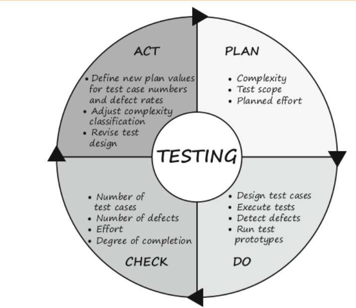
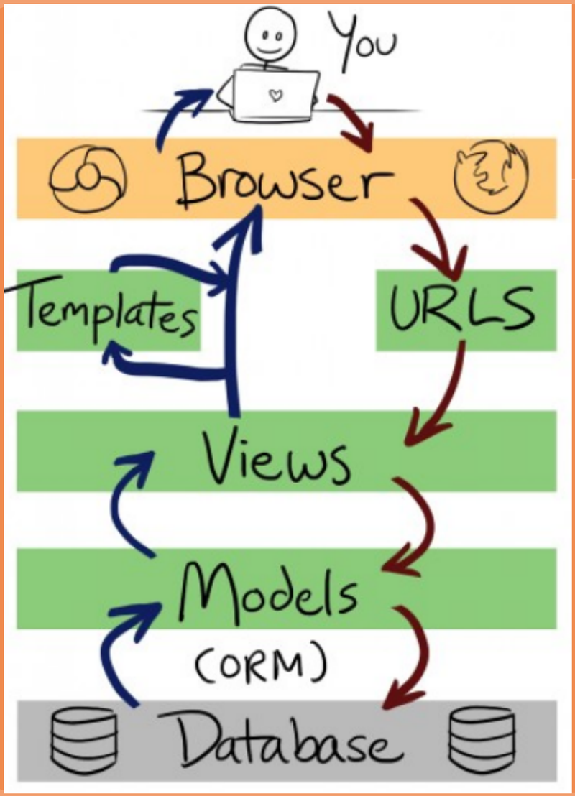
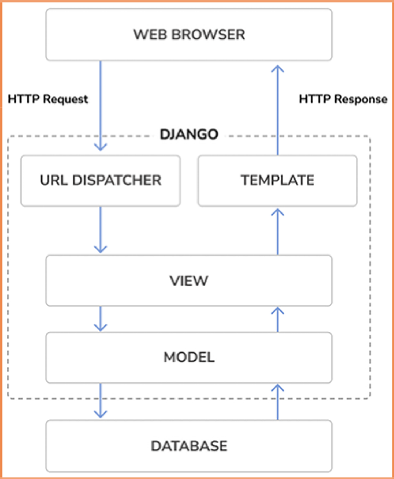
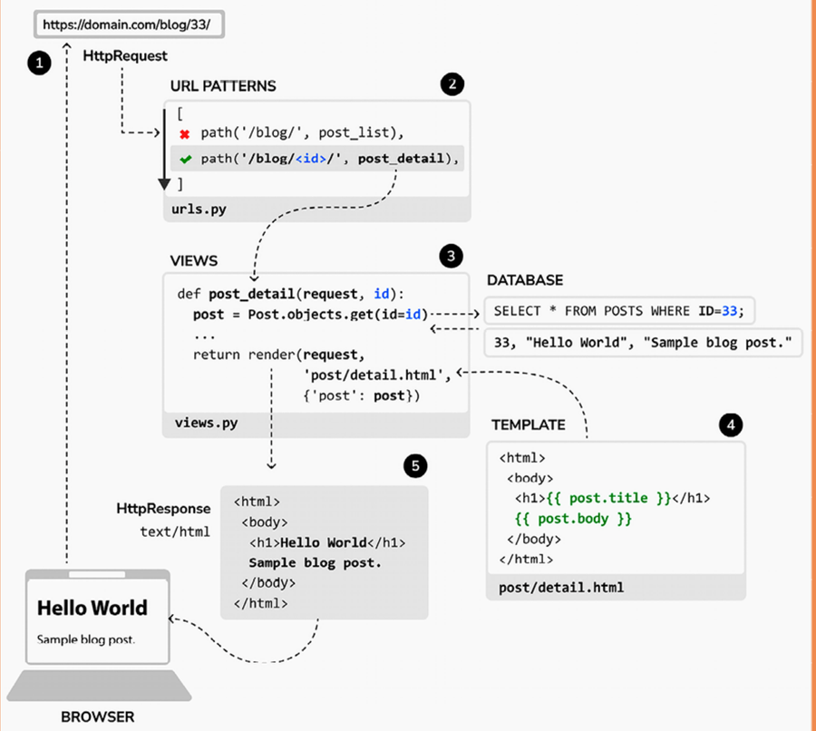

# Test Driven Development (TDD) na Prática

## Uma demonstração com uso do framework Django

Orlando Saraiva Jr

---

## Orlando Saraiva Jr

- Mestre em Tecnologia — FT · Unicamp — 2013
- MBA em Gestão Estratégica de Negócios — Unifian — 2008
- Graduação em Tecnologia em Informática — CESET — 2005

---

## Orlando Saraiva Jr

- Assistente de Suporte Acadêmico — Unesp Rio Claro, desde 2007
- Docente na FATEC Rio Claro, desde 2025
- Docente na FATEC Araras, desde 2018

---

## Orlando Saraiva Jr

Um dos fundadores da comunidade DevRioClaro

[https://www.devrioclaro.com.br/](https://www.devrioclaro.com.br/)

---

# Jornada para o desenvolvimento ágil

---

## A Jornada para o Desenvolvimento Ágil

A transição para o desenvolvimento ágil na prática de projetos de TI está em andamento por muito tempo, desde a disseminação da programação orientada a objetos no final dos anos 1980 e início dos anos 1990.

A abordagem orientada a objetos mudou a maneira como o software é desenvolvido.

---

## A Jornada para o Desenvolvimento Ágil

Os principais objetivos da orientação a objetos eram:

- Aumento da produtividade através da reutilização.
- Redução na quantidade de código por meio de herança e associação.
- Facilitação de alterações de código com blocos de código menores e intercambiáveis.
- Limitação do efeito de erros por encapsulamento dos módulos de código.

---

## A Jornada para o Desenvolvimento Ágil

No entanto, essa melhoria tecnológica também teve um preço - o aumento da complexidade.

Ao decompor o código em pequenos blocos reutilizáveis, o número de relacionamentos, ou seja, dependências entre blocos de código, aumentaram.

Em software procedimentais, a complexidade residia nos blocos aninhados individuais, cuja lógica de fluxo foi aumentando. No software orientado a objetos, a complexidade foi terceirizada para a arquitetura.

---

## Lidando com a complexidade

Havia duas respostas para esse desafio. Uma resposta era a modelagem.

Durante a década de 1990, diferentes linguagens de modelagem foram propostas: OMT, SOMA, OOD, etc. Dela prevaleceu: UML.

Ao representar a arquitetura de software em um modelo, deve ser possível encontrar a estrutura ideal e obter e manter a visão geral.

O desenvolvedores iriam - como esperado - criar o modelo "adequado" e então implementá-lo em o código concreto.

---

## Lidando com a complexidade

No entanto, a modelagem provou ser muito tediosa, mesmo com o melhor suporte de ferramentas.

O desenvolvedor precisou de muito tempo para descobrir o modelo em todos os detalhes.

Nesse ínterim, os requisitos mudaram e as suposições nas quais o modelo se baseava não eram mais válidas.

---

## Lidando com a complexidade

Outra resposta ao desafio de aumentar a complexidade foi "Extreme Programming" (Beck, 1999).

Como o modelo apropriado para o software não foi previsível, os desenvolvedores começaram a traduzir os requisitos diretamente no código em estreita comunicação com o usuário e em iterações curtas (Beck, 2000).

---

## Lidando com a complexidade

O "Desenvolvimento Orientado a Testes" acabou sendo uma consequência útil da Programação Extrema (Beck, 2003).

Ao entrar em território desconhecido, deve-se proteger-se. A sua proteção no desenvolvimento de código é a estrutura de teste.

Os desenvolvedores primeiro constroem uma estrutura de teste e depois a preenchem com pequenos blocos de código.

---

# Manifesto Ágil

---

## Manifesto Ágil

No manifesto, os autores enfatizam os seguintes quatro "revolucionários" valores:

- Indivíduos e interações sobre processos e ferramentas.
- Software que trabalha sobre uma documentação completa.
- Colaboração do cliente em vez de negociação de contratos.
- Responder à mudança ao invés de seguir um plano.

---

## Um dos valores do manifesto

Um dos princípios fundamentais do Manifesto Ágil é: "Software funcionando tem prioridade sobre documentação completa."

Infelizmente, esta declaração de princípios é entendida por muitos como uma renúncia de documentação.

O que se quer dizer, no entanto, é que a documentação seja reduzida ao mínimo ou adiada se o tempo for curto.

Mais tarde, os criadores do Manifesto Ágil tentaram colocar essa afirmação em perspectiva, mas sua intenção é clara: a documentação é secundária.

---

# Ciclo PDCA

---

## Ciclo PDCA

O loop de controle de medição, avaliação de desvios, tomada de contramedidas e avaliando a eficácia, que também é frequentemente referido como o ciclo de Deming (Deming, 1982), é informal em projetos ágeis e deve ser apoiado por promover e praticar a comunicação dentro da equipe.

---

## Ciclo PDCA

---

# Django

---

## Arquitetura MVT do Django

 

---

## Fluxo de uma requisição HTTP

---

# Lições aprendidas com AgendaTech

## IA como auxiliar na criação de testes

- **Ganho de velocidade**: a IA acelera a escrita de testes repetitivos — `setUp`, casos de borda, boilerplate.

- **Viés de confirmação**: quando o código já existe, a IA tende a gerar testes que documentam o comportamento atual — inclusive falhas de design — em vez de especificar o comportamento desejado.

- **Revisão humana é indispensável**: testes gerados por IA precisam ser lidos e validados; o teste "passar" não significa que ele verifica o que deveria.

---

# Hands on !

---

# Perguntas ?

[https://orlandosaraivajr.github.io/](https://orlandosaraivajr.github.io/)

orlando.saraiva@unesp.br

orlando.nascimento@fatec.sp.gov.br
